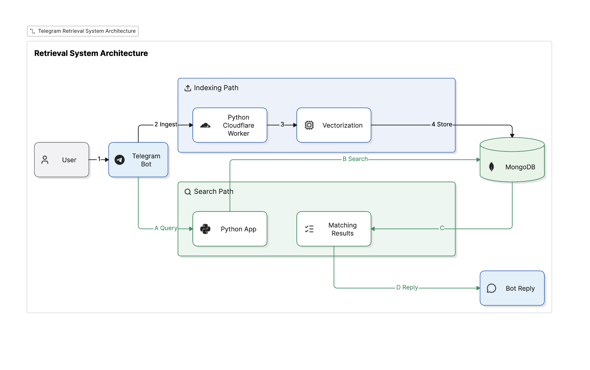

# Note Taker Bot 📝

A Telegram bot that acts as your personal note-taking assistant with **semantic vector search capabilities**. It automatically captures notes sent via Telegram messages, generates embeddings using Google Gemini AI, deduplicates content using SHA-256 hashing, and stores vector embeddings in MongoDB for fast semantic retrieval.



---

## 🚀 Features

- **Automated Note Ingestion**: Every message sent to the bot (not prefixed with a query identifier) is automatically saved as a note.
- **Deduplication**: Hashes message content to prevent duplicate notes from being stored.
- **AI-Powered Embeddings**: Uses **Google Gemini API** (`text-embedding-004` / Google GenAI) to generate high-quality vector embeddings for all notes.
- **Semantic Vector Search**: Query your notes using natural language with the `query:` prefix (e.g., `query: find my notes on database indexing`).
- **Smart Chunking**: Automatically splits long responses to stay within Telegram's maximum message length limits.
- **Event-Driven Processing**: Built with an internal event-driven architecture (`EventEmitter`) for processing updates cleanly.

---

## 🛠 Tech Stack

- **Language**: Python >= 3.13
- **Package Manager**: [uv](https://github.com/astral-sh/uv)
- **Database**: MongoDB (with Vector Search index support)
- **AI & Embeddings**: Google Gemini API (`google-genai`)
- **Integration**: Telegram Bot API (via long-polling)

---

## 📦 Project Structure

```text
note-taker/
├── src/
│   └── note_taker/
│       ├── constants/          # Enums & Event types
│       ├── mongodb/            # MongoDB connection, schema models, & vector search repo
│       ├── utils/              # Gemini embeddings, hashing, cache, settings, & Telegram handler
│       └── main.py             # Main entry point (DB connect, indexes, polling loop)
├── .env.example                # Environment variables template
├── pyproject.toml              # Dependencies & CLI script definition
└── README.md
```

---

## ⚙️ Setup & Installation

### 1. Prerequisites

- Python 3.13 or higher
- [uv](https://github.com/astral-sh/uv) installed
- A Telegram Bot Token (from [@BotFather](https://t.me/BotFather))
- A Google Gemini API Key
- A MongoDB Connection URI (e.g. MongoDB Atlas cluster with Vector Search capability)

### 2. Clone & Install Dependencies

```bash
git clone <repository-url>
cd note-taker

# Sync dependencies using uv
uv sync
```

### 3. Environment Variables

Copy `.env.example` to `.env` and fill in your credentials:

```bash
cp .env.example .env
```

Set the following variables in `.env`:

```env
TELEGRAM_BOT_TOKEN="your-telegram-bot-token"
MONGODB_URI="mongodb+srv://<user>:<password>@cluster.mongodb.net/..."
MONGODB_DATABASE="note-taker"
GEMINI_API_KEY="your-gemini-api-key"
```

---

## 🏃 Running the Application

Start the note-taker bot:

```bash
uv run note-taker
```

Or run directly via python module:

```bash
uv run python -m note_taker.main
```

---

## 💬 Usage

### 1. Save a Note

Simply send any message to your Telegram bot:
> *Meeting notes: Need to finalize the Cloudflare Workers architecture by Friday.*

### 2. Search Notes

Prefix your message with `query:` (case-insensitive) to perform a semantic search:
> `query: finalization deadline for cloudflare`

The bot will perform vector search in MongoDB, filter matches exceeding similarity threshold, and reply with the matching notes!

---

## 🌐 Deployment Notes

- **Long Polling Mode (Current)**: The application is configured to run as a continuous long-polling background process (`poll_telegram()`). It should be deployed on platforms supporting long-lived background workers (e.g., Render, Railway, Fly.io, AWS EC2, VPS).
- **Serverless / Cloudflare Workers**: To run on serverless platforms like Cloudflare Workers, the architecture requires converting `poll_telegram()` to a Telegram **Webhook** endpoint (`setWebhook`) and connecting to MongoDB via HTTP / Data API.
